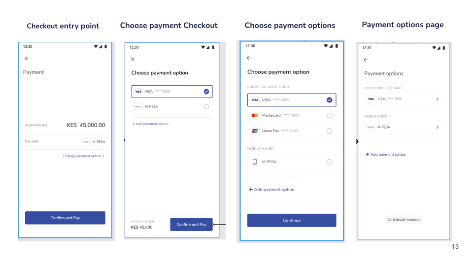

# @sendyit/pay

### In-depth documentation can be found using the link below
[in-depth documentation](https://sendy.atlassian.net/wiki/spaces/PF/pages/edit-v2/1966440548)

## Description
This is a payment experience that integrates into all Sendy products and accept payments from our customers flexibly and securely 

## Key objectives
* To have a consistent payment experience for all users across all sendy platforms
* To abstract payments and payment flows from all the other business units which allows them to concentrate on their core business
* To ensure all apps in Sendy comply to the global  security measures i.e the PCI DSS ( Payment Card Industry Data Security Standard )
* Unifying the code base that affects payments to ensure changes needed can  be made in one central place

## Structure
## How to install
You can npm install using below command.

```
npm install @sendyit/pay
```

## How to use

Go to the src/main.js and add the following lines

```
import payments from "@sendyit/pay";
import router from "./router";
import store from "./store";

const app = createApp(App);

app.use(store);
app.use(router);
app.use(payments, {
  store,
  router,
  config: {
    BASE_URL: process.env.VUE_APP_BASE_URL,
    VGS_VAULT_ID: process.env.VUE_APP_VGS_VAULT_ID,
    VGS_ENVIRONMENT: process.env.VUE_APP_VGS_ENVIRONMENT,
  },
});

app.mount("#app");
```

>### Business unit parameter definitions
>>[See more](docs/BUPARAMETERS.MD)

### How to call the payment library.

So there 6 entry points:
 ```
 1. checkout
 2. payment-option
 3. choose-payment
 4. Choose-payment-checkout - Choose payment page with checkout.
 5. bank-transfer - Pay by Bank Deposit page.
 6. resolve-payment-checkout - For resolving payments
 ```




 To go to checkout page call the following method as shown below by passing the Bu payload

 ```
  const buPayload = {
    user_id: 1,
    entity_id: 1,
    currency: 'KES',
    country_code: 'KE',
    amount: '100',
    success_callback_url: '',
    fail_callback_url: '',
    txref: this.txref,
    bulk: false,
    paybill_no: '4444444',
    email: 'johndoe@gmail.com',
    authToken: '', //Add Jwt token for authentication.
    firstname: 'John',
    lastname: 'doe',
    payment_options: [1, 2],// This are the payment_methods_id you get from the paymeht methods available. They are used to filter the payment methods you want the user shown. If you don't wnat to filter live it empty.
    company_code: 'SKML', // add compnay code to associate a transaction to it's repective company.
    locale: 'en', // add locale. 'en' & 'fr' are the supported languages now.
  };

  this.$paymentInit(buPayload, 'checkout'); //the 2nd argument can be a 'checkout', 'payment-option', 'choose-payment' or 'choose-payment-checkout, in order to access the 5 entry points of the Bu as listed above.
 ```
## How to build and test
 In order to help and collaborate, clone this repo, then add what you can improve, and build the npm version of the repo locally in the dist file in the root of the folder, using the below command

 ```
 npm run build-lib
 ```
To create your own changes, you'll have to create your own branch from master, then create a merge request to master.

## Contribution
[Follow this link to contribute](https://sendy.atlassian.net/wiki/spaces/PF/pages/2241724417/How+to+contribute.) 

## To version the App
  This project uses [Semantic Versioning 2.0.0](https://docs.npmjs.com/about-semantic-versioning) starting with `v1.0.0`.

  Use the below command for versioning of the app.

  ```
  npm version patch -m "Add a comment for the versioning"
  ```

## Releasing / Publishing
In  order to publish the app, use the below command

 ```
 npm publish
 ```


## Credits:
* Telephone Number parsing, validation by vue-tel-input
* VGS support 

